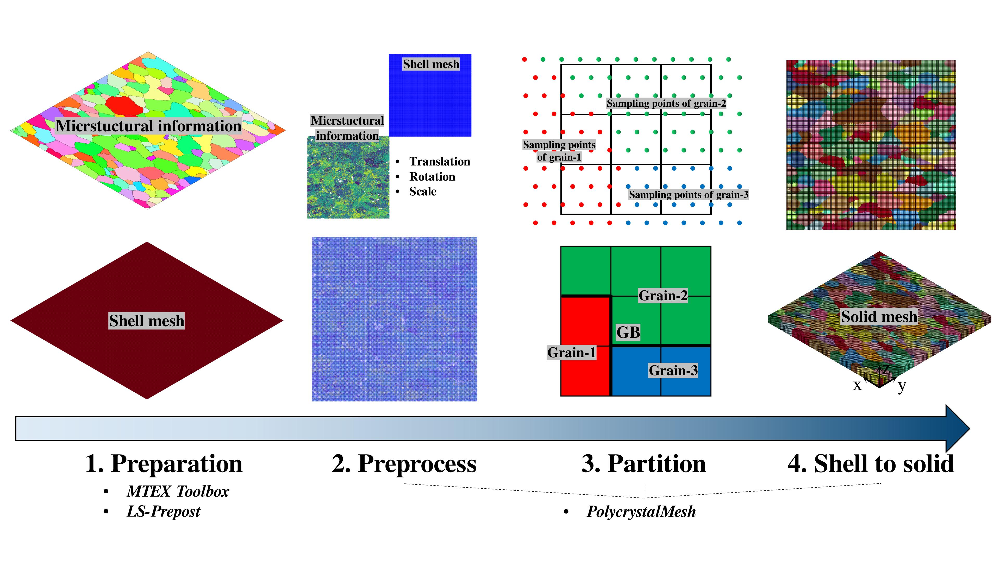
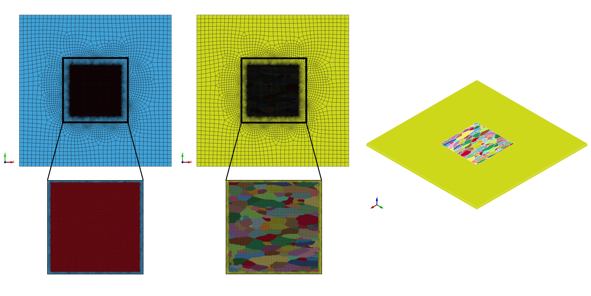
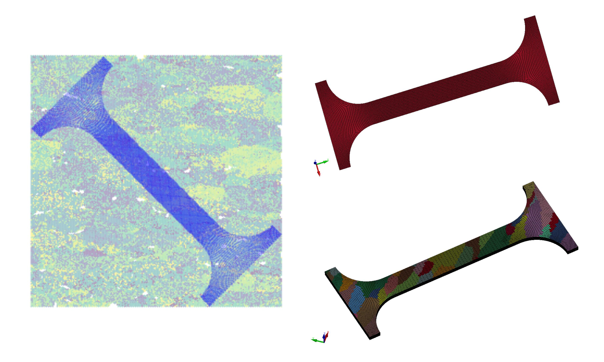

# PolycrystalMesh
**PolycrystalMesh** is a program to map the microstructures with 
real grain structure and orientation.
The motivation of this program is to sustain better mesh quality and 
then conduct the mesh partition.
The mapping method also ensures the possibility to map the grain structures to
complex specimen geometry.

### Note
1. The situation that the sampling points of EBSD analysis is sparser 
with the respect to mesh density, or some sampling points are cleaned up in some low-quality
regions, have been well accounted for.
We developed an iteractive method to consider the surrounding region for a single mesh to look for 
sampling points, so this program is stable even if the step size of EBSD is large.

2. Basically, it takes 20 minutes or more to partition the mesh 
(200*200 shell and 20000 sampling points). It depends on the problem size.
Method to accelerate the partition that we divide the microstructures and mesh into several regions
has been implemented and it will be automatically utilized.

3. Currently, there is no GUI for this program. So try to code your own scripts by referring to
the example when conduct the partition.

### Prerequisites
MTEX Toolbox

### Examples
1. Rectangle region (./example/rectangle_region)

2. Hierarchical model (./example/hierarchical_model)

3. Dogbone (applicable for in-situ tensile test) (./example/dogbone)

### Usage
1. Run the ./matlab_script/make_input.m with MTEX Toolbox to 
partition the grain and making some input information for the next step.
2. Make a keyword file for a shell mesh.
3. Run the ./Script.py to partition the shell mesh and drag it into
solid mesh.

### Citation
Please cite this paper if you used this repo.
https://doi.org/10.1016/j.ijplas.2024.104052

Jiawei CHEN. (2023). PolycrystalMesh. GitHub. https://github.com/MaynotbeGarychan/PolycrystalMesh
